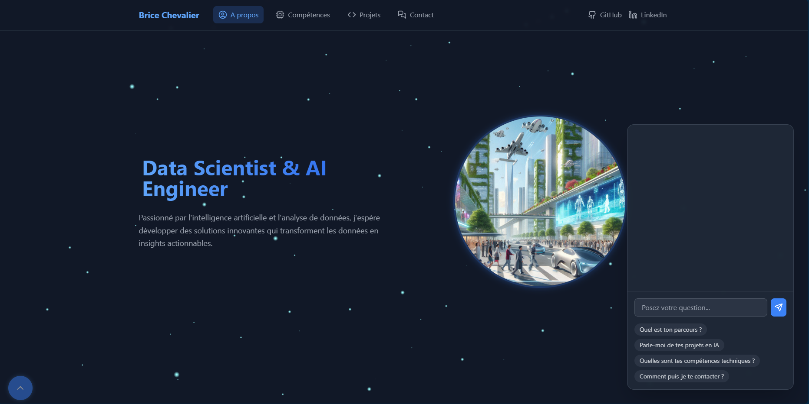

# Portfolio IA – Brice Chevalier


Bienvenue sur mon portfolio interactif, propulsé par l’IA !  
Ce projet met en avant mon parcours, mes compétences techniques, mes projets et propose un chatbot IA pour répondre à vos questions.

---

## 🚀 Aperçu

- **Frontend** : React 18, Vite, TailwindCSS
- **Chatbot IA** : Génération de réponses contextuelles avec RAG (Retrieval Augmented Generation)
- **Recherche sémantique** : Embeddings & vectorisation pour réponses précises
- **Formulaire de contact** : Validation RGPD, envoi via Formspree
- **Effets visuels** : Animations de bulles, interface responsive et moderne

---

## 📸 Demo



---

## 🧑‍💻 Fonctionnalités principales

- **Navigation fluide** entre les sections : À propos, Compétences, Projets, Contact
- **Chatbot IA** : Posez vos questions sur mon parcours, mes compétences, mes projets, etc.
- **Extraction dynamique du contenu** pour le chatbot (RAG)
- **Formulaire de contact** sécurisé, avec validation et consentement RGPD
- **Design responsive** et animations modernes

---

## 📂 Structure du projet

```
src/
  components/        # Composants React (Portfolio, Chatbot, Menu, etc.)
  services/          # Logique métier (IA, embeddings, extraction de contenu)
  config/            # Configuration du chatbot et des sections
  hooks/             # Hooks personnalisés
  assets/            # Images et icônes
public/
  images/            # Images du portfolio
  B.png, vite.svg    # Favicon et logos
index.html           # Point d'entrée
tailwind.config.js   # Configuration Tailwind
vite.config.js       # Configuration Vite
```

---

## ⚡️ Installation & Lancement

1. **Cloner le repo**
   ```bash
   git clone https://github.com/<ton-username>/<ton-repo>.git
   cd <ton-repo>
   ```

2. **Installer les dépendances**
   ```bash
   npm install
   ```

3. **Configurer les variables d’environnement**
   - Crée un fichier `.env` à la racine pour tes clés API (HuggingFace, etc.)

4. **Lancer en mode développement**
   ```bash
   npm run dev
   ```

5. **Build pour la production**
   ```bash
   npm run build
   ```

---

## 🤖 Technologies utilisées

- **React** – UI moderne et réactive
- **Vite** – Build ultra-rapide
- **TailwindCSS** – Style utilitaire
- **HuggingFace API** – IA, embeddings, génération de texte
- **Formspree** – Gestion du formulaire de contact
- **uuid, lucide-react** – Utilitaires et icônes

---

## 📬 Contact

- [LinkedIn](https://linkedin.com/in/blackliss)
- [GitHub](https://github.com/Memaii)

---

## 📄 License

Ce projet est sous licence MIT.

---

> **Remarque :**  
> Le chatbot IA ne fournit que des réponses basées sur le contenu du portfolio.  
> Pour toute question technique ou suggestion, n’hésitez pas à ouvrir une issue ou à me contacter !

---

**Brice Chevalier – Data Scientist & AI Engineer**
